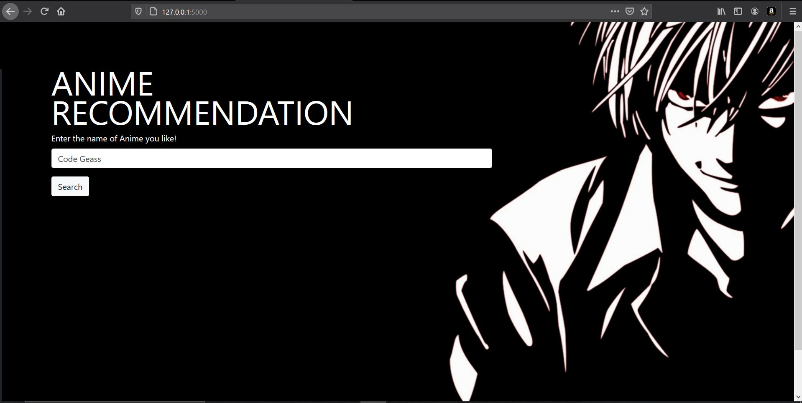
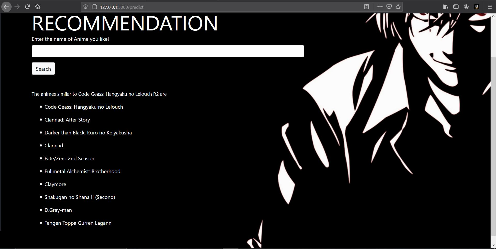

# Anime-Recommendation
 It is a content based Anime Recommendation.
 
 In this website when a user enters an Anime, it recommends top 10 animes of same genre based on user ratings.
 _________________________________________________________________________________________________________________________________________________________________________________
 ### App
- The Frontend of the website is made using HTML, CSS and Bootstrap.
- The Frontend and model are integrated in the website using Flask and python.
- If you want to try the project, then clone this repo and run
```
python app.py
```
_________________________________________________________________________________________________________________________________________________________________________________________
Requirements are all listed in requirements.txt
________________________________________________________________________________________________________________________________________________________________________________________
### Working of app



 
